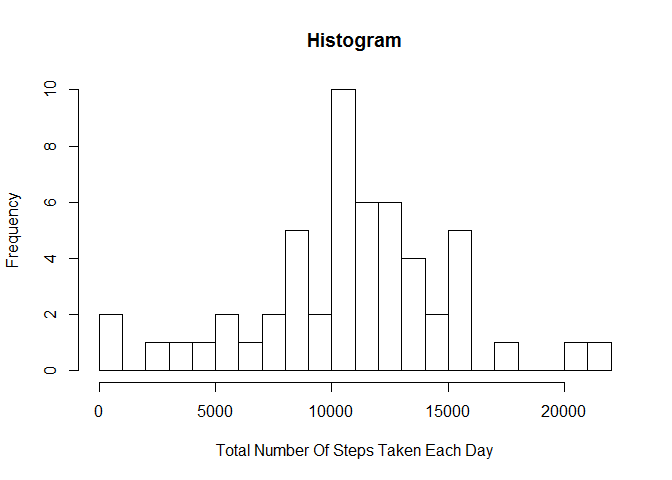
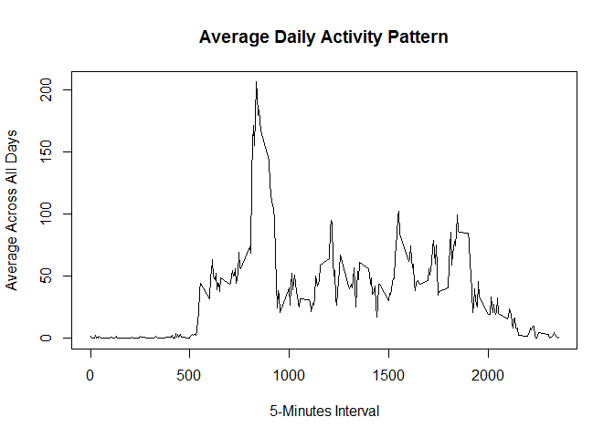
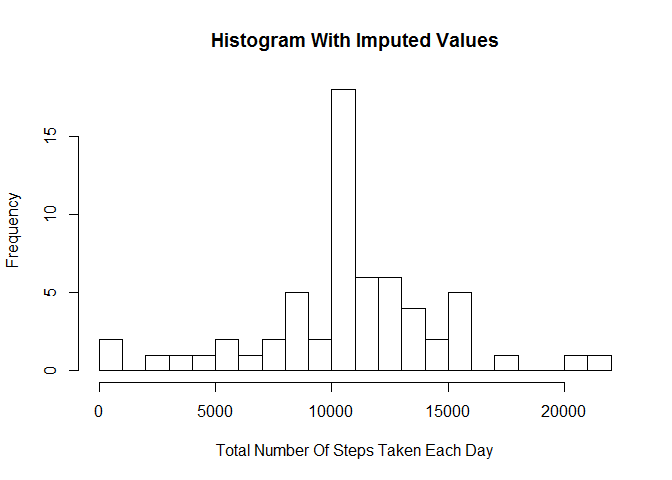
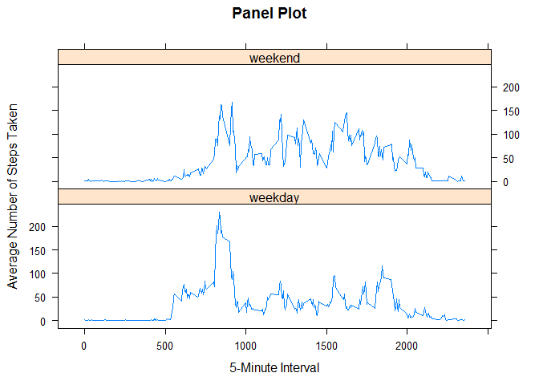

# Reproducible Research: Peer Assessment 1

## Introduction

This assignment makes use of data from a personal activity monitoring device. This device collects data at 5 minute intervals through out the day. The data consists of two months of data from an anonymous individual collected during the months of October and November, 2012 and include the number of steps taken in 5 minute intervals each day.

## Loading and preprocessing the data

First of all we define the relative path/name for the files:


```r
zip_File <- "./activity.zip"
csv_File <- "./activity.csv"
```


If the file hasn't been unzipped before, then we unzip that now:


```r
if (!file.exists(csv_File)) {
        unzip(zip_File)
}
```

We load the dataset into R with the function `read.csv()`, specifying:

- Comma separator for the fields in a row.
- *"NA"* for missing values.
- Strings to be loaded as strings, not as Factors.


```r
file <- read.csv(csv_File, 
                 sep = ",", 
                 na.strings = "NA", 
                 stringsAsFactors = FALSE)
```

Moreover, we convert the *date* column to `Date` format afterwards:


```r
file$date <- as.Date(file$date)
```

We can see the structure of the file now:


```r
str(file)
```

```
## 'data.frame':	17568 obs. of  3 variables:
##  $ steps   : int  NA NA NA NA NA NA NA NA NA NA ...
##  $ date    : Date, format: "2012-10-01" "2012-10-01" ...
##  $ interval: int  0 5 10 15 20 25 30 35 40 45 ...
```

## What is mean total number of steps taken per day?

We can ignore the missing values in the dataset for this part of the assignment, so we select the complete cases from the file:


```r
cc <- complete.cases(file)
file_cc <- file[cc,]
```
Then, only considering the complete cases, we calculate the total number of steps taken per day:


```r
total_daily <- aggregate(steps ~ date, data=file_cc, sum)
```
We use that to make a histogram of the total number of steps taken each day, with 20 breaks, where we can already appreciate that the mean of the total number of steps taken per day should be, roughly speaking, between 10000 and 11000 steps:


```r
hist(total_daily$steps, 
     breaks = 20,
     xlab   = "Total Number Of Steps Taken Each Day",
     main   = "Histogram")
```

 

And finally, we effectively calculate the mean and median of the total number of steps taken per day. We can see that our guess in the previous histogram was correct:


```r
mean(total_daily$steps)
```

```
## [1] 10766.19
```

```r
median(total_daily$steps)
```

```
## [1] 10765
```

## What is the average daily activity pattern?

We keep on working with the complete cases dataset `file_cc` for this part too.

In order to study what the daily activity pattern is, we need to calculate the average number of steps taken by 5-minutes interval, averaged accross all days:


```r
avg_minutes <- aggregate(steps ~ interval, data=file_cc, mean)
```

Now we are using this `avg_minutes` dataset for making a time series plot (type = "l") of the 5-minutes interval (x-axis) and the average number of steps taken, averaged across all days (y-axis)


```r
plot(steps ~ interval,
     data = avg_minutes,
     type = "l", 
     main = "Average Daily Activity Pattern",
     xlab = "5-Minutes Interval", 
     ylab = "Average Across All Days")
```

 

We can see that there are several peaks in the plot, being the maximum of them at the interval **835** (i.e. the interval from *8:35 am* to *8:40 am*), with an average number of steps of **206.1698**. This is effectively shown here:


```r
avg_minutes[which.max(avg_minutes$steps), ]
```

```
##     interval    steps
## 104      835 206.1698
```

## Imputing missing values

First of all, we are going to explore which missing values we have in the full dataset `file` and, moreover, how they are distributed by columns and by rows. This will be very helpful for answering the questions of the assignment.

Just checking the missing values by columns we can see that all of them are located in the *steps* column, where we have a total of **2304** missing values:


```r
colSums(is.na(file))
```

```
##    steps     date interval 
##     2304        0        0
```

Now, checking the rows that aren't complete cases, we can see that the missing values are all concentrated in 8 full days (the number of 5-minutes intervals for each day is 288):


```r
file_nocc <- file[!cc,]
table(file_nocc$date)
```

```
## 
## 2012-10-01 2012-10-08 2012-11-01 2012-11-04 2012-11-09 2012-11-10 
##        288        288        288        288        288        288 
## 2012-11-14 2012-11-30 
##        288        288
```
Our strategy for filling in the missing values will be to impute the mean for that 5-minutes interval, so we proceed with the following steps:

- We merge the full dataset `file` with the previously computed dataset `avg_minutes`, that has the  average number of steps taken by 5-minutes interval, averaged accross all days:


```r
merged_file <- merge(file, avg_minutes, by = "interval")
head(merged_file,4)
```

```
##   interval steps.x       date  steps.y
## 1        0      NA 2012-10-01 1.716981
## 2        0       0 2012-11-23 1.716981
## 3        0       0 2012-10-28 1.716981
## 4        0       0 2012-11-06 1.716981
```

- We select the rows with missing values *NA* and we fill each of them with the corresponding mean for that 5-minutes interval, that we have in the second part of the merged file (*steps.y*):


```r
na_rows <- is.na(merged_file$steps.x)
merged_file$steps.x[na_rows] <- merged_file$steps.y[na_rows]
head(merged_file,4)
```

```
##   interval  steps.x       date  steps.y
## 1        0 1.716981 2012-10-01 1.716981
## 2        0 0.000000 2012-11-23 1.716981
## 3        0 0.000000 2012-10-28 1.716981
## 4        0 0.000000 2012-11-06 1.716981
```

- Then we extract the first three columns and rename the *steps.x* header to have the new dataset equal to the original one but with the missing data filled in:


```r
imputed_file <- merged_file[,c(1:3)]
names(imputed_file)[2] <- "steps"
head(imputed_file,4)
```

```
##   interval    steps       date
## 1        0 1.716981 2012-10-01
## 2        0 0.000000 2012-11-23
## 3        0 0.000000 2012-10-28
## 4        0 0.000000 2012-11-06
```
- We can see that we don't have any missing value now:


```r
colSums(is.na(imputed_file))
```

```
## interval    steps     date 
##        0        0        0
```
Let's make a histogram of the total number of steps taken each day and let's calculate the mean and median total number of steps taken per day, as in the first part of the assignment, but now considering the `imputed_file` with the missing data imputed:


```r
total_daily_imputed <- aggregate(steps ~ date, data=imputed_file, sum)

hist(total_daily_imputed$steps, 
     breaks = 20,
     xlab   = "Total Number Of Steps Taken Each Day",
     main   = "Histogram With Imputed Values")
```

 

```r
mean(total_daily_imputed$steps)
```

```
## [1] 10766.19
```

```r
median(total_daily_imputed$steps)
```

```
## [1] 10766.19
```
Once done this, we can compare the results and we can say the following about the impact of imputing missing data on the estimates of the total daily number of steps:

- The median differ slightly - *10765* before, *10766.19* now - but the mean is exactly the same as before - *10766.19* both..
- The histogram looks pretty similar, with exactly the same Frequencies in all the bars except for the central one (the one from 10000 to 11000 steps), that has a taller bar: it was around 10 before and it is around 18 now (the histogram plot has re-scaled the Frequencies in the y-axis due to this).

Let's explain these two points. Having a look at how the missing values were distributed and how we have filled them in, we can explain that as follows:

- As we have already checked before, the missing values were all in the *steps* column and concentrated in 8 full days.
- We have filled the missing values with the mean for that corresponding 5-minutes interval, averaged accross all the days that had available values.
- So, for those 8 days with missing values before, the "new total" number of steps those days (after filling them in) has to be exactly the mean of the total number of steps taken per day of the first part of the assignment (the means for each 5-minutes interval added up), what is the value *10766.19*. 

This is why:

- The mean *10766.19* is not changing.
- The median gets closer to the mean (in fact it becomes the same now).
- The histogram looks like that, because that value *10766.19* is more frequent now: exactly 8 days more frequent (the days imputed). This is reflected just increasing in 8 units the frequency in the central bar of the histogram, the one between 10000 and 11000 total number of steps.


## Are there differences in activity patterns between weekdays and weekends?

We use the dataset `imputed_file` with the filled-in missing values for this part.

First of all we are going to set the Local Time to English to get the week days in English:


```r
Sys.setlocale("LC_TIME", "English")
```

```
## [1] "English_United States.1252"
```
We create a new factor variable *daytype* in the dataset with two levels - "weekday" and "weekend" -  indicating whether a given date is a weekday or weekend day:


```r
imputed_file$daytype <- as.factor(ifelse(weekdays(imputed_file$date)=="Saturday" | 
                                         weekdays(imputed_file$date)=="Sunday", 
                                         "weekend",
                                         "weekday"))
```

Having a look at the structure of the file and the first records:


```r
str(imputed_file)
```

```
## 'data.frame':	17568 obs. of  4 variables:
##  $ interval: int  0 0 0 0 0 0 0 0 0 0 ...
##  $ steps   : num  1.72 0 0 0 0 ...
##  $ date    : Date, format: "2012-10-01" "2012-11-23" ...
##  $ daytype : Factor w/ 2 levels "weekday","weekend": 1 1 2 1 2 1 2 1 1 2 ...
```

```r
head(imputed_file,5)
```

```
##   interval    steps       date daytype
## 1        0 1.716981 2012-10-01 weekday
## 2        0 0.000000 2012-11-23 weekday
## 3        0 0.000000 2012-10-28 weekend
## 4        0 0.000000 2012-11-06 weekday
## 5        0 0.000000 2012-11-24 weekend
```
We want to make a panel plot containing a time series plot (type = "l") of the 5-minutes interval (x-axis) and the average number of steps taken, averaged across all weekday days or weekend days (y-axis).

Before plotting, we need to compute the mean of the number of the *steps* by *interval* and *daytype*. We are doing so here, checking the first records of the new dataset `avg_min_daytype` afterwards:


```r
avg_min_daytype <- aggregate(steps ~ interval + daytype, data=imputed_file, mean)

head(avg_min_daytype,4)
```

```
##   interval daytype     steps
## 1        0 weekday 2.2511530
## 2        5 weekday 0.4452830
## 3       10 weekday 0.1731656
## 4       15 weekday 0.1979036
```
Let's make the panel plot now:


```r
library(lattice)

xyplot(steps ~ interval | daytype, 
       data   = avg_min_daytype,
       type   = "l",
       layout = c(1,2),
       xlab   = "5-Minute Interval",
       ylab   = "Average Number of Steps Taken",
       main   = "Panel Plot")
```

 

We can see from the plot some differences in the activity patterns between weekdays and weekends, for instance:

- The number of steps taken in weekends seems bigger than the ones taken in weekdays (on average). This could possibly be because this person has an Office job.
- The number of steps in weekends are more homogeneusly distributed during the day than in the weekdays. Weekends steps aren't so concentrated in few peaks during the day, as it is the case in weekdays.     
